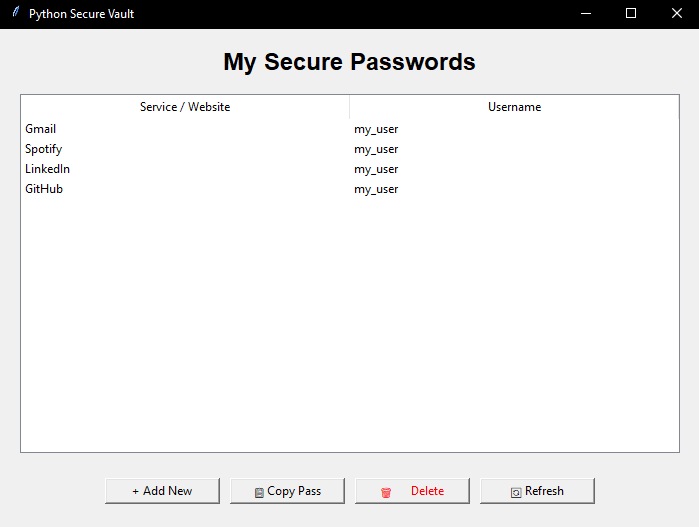

# Secure Python Password Vault


A high-security desktop password manager featuring AES-256 GCM authenticated encryption, Argon2id key derivation, and a local SQLite backend. This project provides a secure, local-only alternative to cloud-based password managers.

<p align="center">
  
</p>

## Features
* **Authenticated Encryption:** Uses AES-256 in Galois/Counter Mode (GCM) to ensure data confidentiality and integrity.
* **Brute-Force Resistance:** Implements Argon2id for high-security key derivation from a Master Password.
* **Zero-Knowledge Architecture:** Data is encrypted locally; no plain-text passwords ever touch the disk or a network.
* **Security UX:** Includes automatic clipboard clearing (30 seconds) and master password session gating.

## Tech Stack
* **Language:** Python 3.14
* **GUI:** Tkinter
* **Database:** SQLite
* **Cryptography:** cryptography and argon2-cffi libraries

---

## Security Implementation
This project prioritizes modern cryptographic standards to protect user data:

* **Key Derivation (Argon2id):** Rather than using raw passwords, keys are derived using Argon2id. It is a memory-hard function specifically designed to resist GPU-based brute-force and rainbow table attacks.
* **Encryption (AES-256 GCM):** The application utilizes AES-GCM to provide Authenticated Encryption. This allows the system to detect if the database file has been tampered with or corrupted before attempting decryption.


* **Unique Salts and Nonces:** * Each entry utilizes a unique Salt, ensuring that identical master passwords produce different encryption keys.
    * Each password is encrypted with a unique Nonce (Number used once) to prevent pattern recognition within the database.

---

## Getting Started

### Prerequisites
Ensure you have Python 3.x installed on your system.

1. **Clone the repository:**
   ```bash
   git clone [https://github.com/PavleBozovic/PasswordVault.git](https://github.com/PavleBozovic/PasswordVault.git)
   cd PasswordVault
2. **Set up a Virtual Environment and Install Dependencies:**

    ```bash
    python -m venv venv
    .\venv\Scripts\activate
    pip install -r requirements.txt
3. **Run the Application:**

    ```bash
    python main.py
